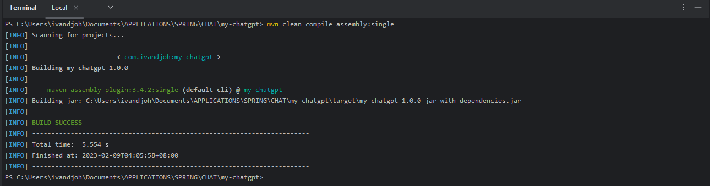
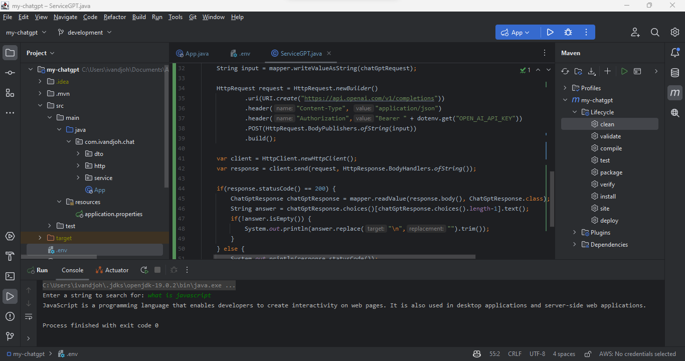

# My ChatGPT - CLI Application

## Description

This is a Java CLI Application that talks to the [ChatGPT](https://chat.openai.com/auth/login)

## Prerequisites

To run this application you need to have the following installed on your machine

- Java 11 or later
- Maven 3.6.3 or later
- dotenv-java 2.3.2

## Installation

To install this application, clone the repository and run the following command

```bash
git clone https://github.com/ivandi1980/my-ChatGPT.git
cd my-ChatGPT
mvn clean install
```

## Build

before you build this application, you need to add this (`Plugin`) line code in to your pom.xml

```xml

<plugin>
    <artifactId>maven-assembly-plugin</artifactId>
    <configuration>
        <archive>
            <manifest>
                <mainClass>fully.qualified.MainClass</mainClass>
            </manifest>
        </archive>
        <descriptorRefs>
            <descriptorRef>jar-with-dependencies</descriptorRef>
        </descriptorRefs>
    </configuration>
</plugin>
```

and then, run the following command

```bash
mvn clean compile assembly:single
```

## Usage

To run this application, run the following command

```bash
java -jar .\target\my-chatgpt-1.0.0-jar-with-dependencies.jar
```

## Screenshots

Build Process



Application Result

